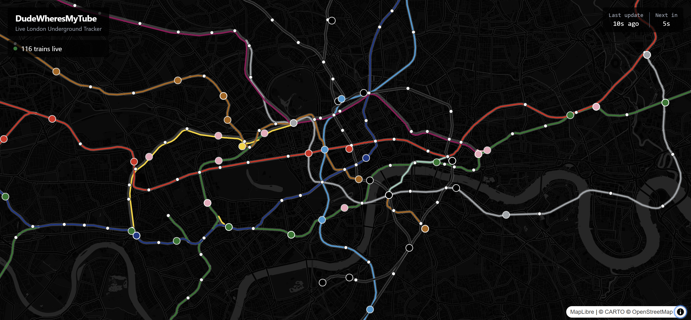

# DudeWheresMyTube

Real-time London Underground train tracker with smooth animations.



## Features

- **Live train positions** - Polls TfL API every 15 seconds
- **Smooth animations** - Velocity-based easing for fluid train movement
- **Track-accurate paths** - Trains follow actual tube line geometry
- **All 11 Underground lines** - Bakerloo, Central, Circle, District, Hammersmith & City, Jubilee, Metropolitan, Northern, Piccadilly, Victoria, Waterloo & City

## Tech Stack

- React 19 + TypeScript
- MapLibre GL JS
- TanStack Query
- Tailwind CSS
- Vite

## Getting Started

```bash
npm install
npm run dev
```

Open [http://localhost:5173](http://localhost:5173)

## Data Sources

- Train positions: [TfL Unified API](https://api.tfl.gov.uk/)
- Track geometry: [O'Brien's London Tube GeoJSON](https://oobrien.com/2014/01/london-tube-stats/)
